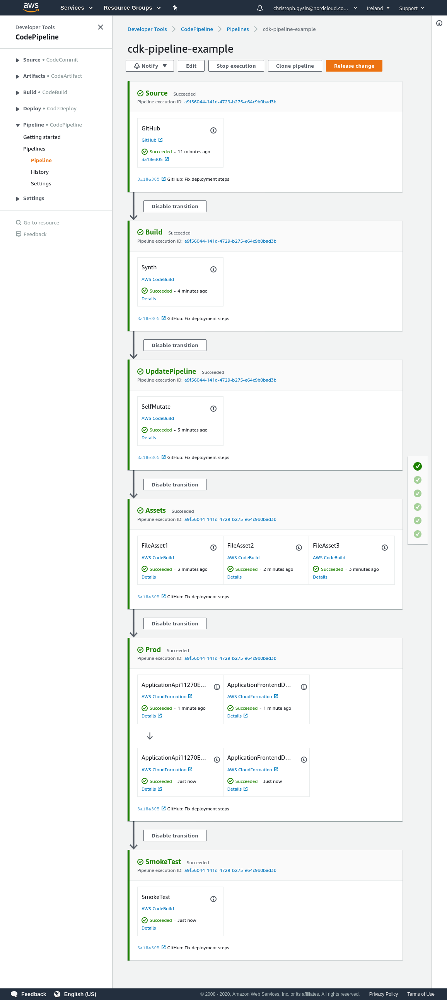

# AWS CDK pipelines example

This repository contains an example CDK pipeline that deployes a simple
serverless API and a static frontend served from CloudFront. Once deployed, the
pipeline will update itself on git push.

## Setup

1. Fork this repository
2. Update `.env` with your domain and GitHub name
3. Create a GitHub personal access token with scopes `repo` and `admin:repo_hook`.
4. Store the secret in AWS SecretsManager:
```
$ aws secretsmanager create-secret --name github-token --secret-string=<TOKEN>
```
5. Deploy the pipeline:
```
$ npm ci
$ npm run bootstrap
$ npm run build+deploy Pipeline
```
When the pipeline is deployed, it will automatically update itself to the state in your repository.



## Stacks

### Pipeline

The Pipeline that updates itself, deploys assets and all Application
stacks.

### Application

Contains two stacks:

#### API

A simple serverless API, accessible on a custom domain.

#### Frontend

A CloudFront distribution that serves the contents of the dist/ folder
in this repository from an S3 bucket via an OriginAccessIdentity, and
automatically invalidates the distribution on updates.
